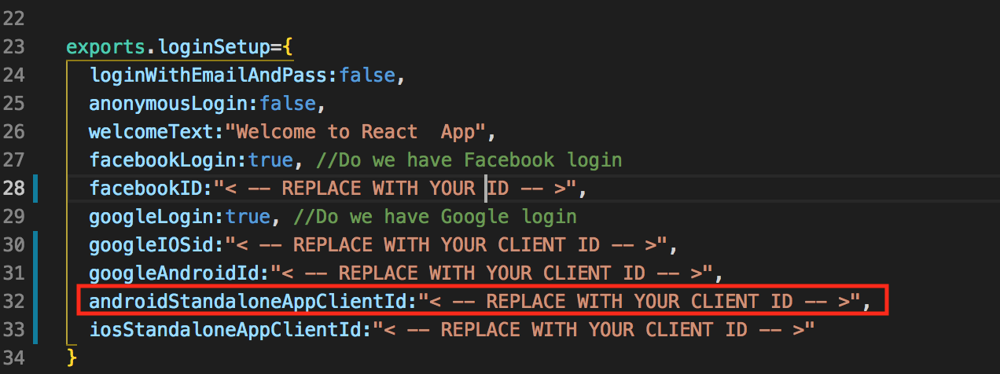

# App preview app

#### Requirements

This App Preview requires that you have purchased and installed React App Builder.

#### Install

Download the app preview app from your CodeCanyon Downloads.

Extract the zip file.

**Important**: Copy the [project\_config.json](https://mobidonia.support-hub.io/articles/project-confiigjson-1431) file from your [React App Build installation](https://mobidonia.support-hub.io/knowledgebase/129) to your App Preview.

Open the folder in VS Code.

The folder structure should look like this


Open a terminal and execute

```text
rab
```

You should see the menu now


#### Setup App Preview \( required \)

This option will do the following actions

* Install NPM modules
* Set up firebase\_config.js so your apps know how to connect to firebase
* Set up app.json

#### Run Preview App Locally

This option will start your app locally. It will open the browser, and you will have the option to run on a device or simulator. You can see your app, take screenshots and if you don't like some image you can change in assets/images and in App/images.


#### Deploy android app

When you are ok, how your preview app looks, you can execute the option to make an android .aab file. At the end of the process, you will receive a link to this .aab file. The file will be around 50MB, but when uploaded on Google Play will be resized to around 16MB.

Follow the onscreen instructions from expo.

Learn more about [publishing with expo](https://docs.expo.io/versions/v35.0.0/distribution/building-standalone-apps/).

#### Deploy iPhone app

When you are ok, how your preview app looks, you can execute the option to make an iPhone app.

Follow the onscreen instructions from expo.

This process will make the .IPA file for you. And you can do this from MAC, Windows and Linux.

But you will need a MAC computer to upload the .IPA file to Apple iTunes Connect.

There are some tools to upload ipa from windows, you can google search for that.

Or, there is a [MacinCloud](https://www.macincloud.com/) that you can rent.

Learn more about [publishing with expo](https://docs.expo.io/versions/v35.0.0/distribution/building-standalone-apps/).

#### Add a preview app

Execute this option when your app is live on google play or AppStore.

It will add information on your landing page and in your builder. So users can download the app and login with their user/pass to preview the apps.

### How to set up Google login

#### Deploying to a standalone app on Android

If you want to use Google Sign In for a standalone app, you can follow these steps. These steps assume that you already have it working on the Expo client app. If you have already created an API key for Google Maps, you skip steps 3 through 8, inclusive.

* **Get a Google API Key for your app** : `skip this if you already have one, eg: for Google Maps`
  1. Build a standalone app and download the apk, or find one that you have already built.
  2. Go to the [Google Developer Credentials](https://console.developers.google.com/apis/credentials)
  3. Click **Create credentials**, then **API Key**, and finally click **RESTRICT KEY** in the modal that pops up.
  4. Click the **Android apps** radio button under **Key restriction**, then click **+ Add package name and fingerprint**.
  5. Add your `android.package` from `app.json` \(eg: `ca.brentvatne.growlerprowler`\) to the **Package name** field.
  6. Run `expo fetch:android:hashes`.
  7. Take `Google Certificate Fingerprint` from previous step and insert it in the **SHA-1 certificate fingerprint** field.
  8. Press **Save**.
* **Get an OAuth client ID for your app**
  1. Build a standalone app and download the apk, or find one that you have already built.
  2. Go to the [Google Developer Credentials](https://console.developers.google.com/apis/credentials).
  3. Click **Create credentials**, then **OAuth client ID**, then select the **Android** radio button.
  4. Run `expo fetch:android:hashes`.
  5. Take `Google Certificate Fingerprint` from previous step and insert it in the **Signing-certificate fingerprint** field.
  6. Add your `android.package` from `app.json` \(eg: `ca.brentvatne.growlerprowler`\) to the **Package name** field.
  7. Press **Create**.
* **Add the configuration to your app**
  1. Build a standalone app and download the apk, or find one that you have already built.
  2. Go to the [Google Developer Credentials](https://console.developers.google.com/apis/credentials) and find your API key.
  3. Open `app.json` and add your **Google API Key** to `android.config.googleSignIn.apiKey`.
  4. Run `expo fetch:android:hashes`.
  5. Take `Google Certificate Hash` from the previous step to `app.json` under `android.config.googleSignIn.certificateHash`.
  6. When you use `Google.logInAsync(..)`, pass in the **OAuth client ID** as the `androidStandaloneAppClientId` option.
  7. Rebuild your standalone app.

Note that if you've enabled Google Play's app signing service, you will need to grab their app signing certificate in production rather than the upload certificate returned by `expo fetch:android:hashes`. You can do this by grabbing the signature from Play Console -&gt; Your App -&gt; Release management -&gt; App signing, and then going to the [API Dashboard](https://console.developers.google.com/apis/) -&gt; Credentials and adding the signature to your existing credential.

#### Add androidStandaloneAppClientId in the project

In the downloaded project you will find file config.js. In the object **loginSetup** you will find variable called **androidStandaloneAppClientId,** replace the value of this variable with the **Client ID** that you have created in the previous step.



#### Deploying to a standalone app on iOS

If you want to use native sign in for a standalone app, you can follow these steps. These steps assume that you already have it working on the Expo client app.

1. Add a `bundleIdentifier` to your `app.json` if you don't already have one.
2. Open your browser to [Google Developer Credentials](https://console.developers.google.com/apis/credentials)
3. Click **Create credentials** and then **OAuth client ID**, then choose **iOS**.
4. Provide your `bundleIdentifier` in the **Bundle ID** field, then press **Create**.
5. Add the given **iOS URL scheme** to your `app.json` under `ios.config.googleSignIn.reservedClientId`.
6. Wherever you use `Google.logInAsync`, provide the **OAuth client ID** as the `iosStandaloneAppClientId` option.
7. Rebuild your standalone app.

#### Add iosStandaloneAppClientId in the project

In the downloaded project you will find file config.js. In the object **loginSetup** you will find variable called **iosStandaloneAppClientId,** replace the value of this variable with the **Client ID** that you have created in the previous step.


