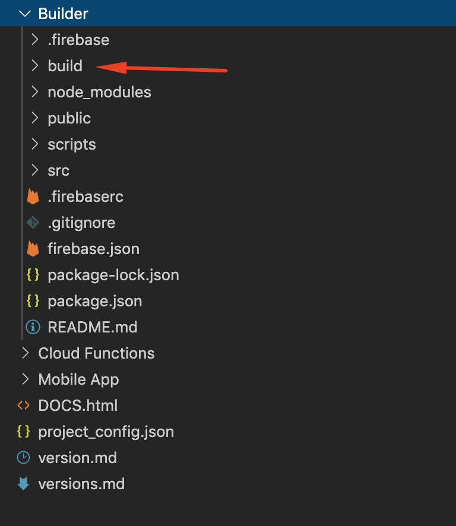

# Deploy Builder page

In Visual Studio Code's terminal run **rabinstaller.**

From the menu, select the "Deploy builder page". You will be asked where you want the builder page to be uploaded.

1. Firebase Hosting
2. Netlify
3. My Own Hosting

After you publish your project, you can log in to is as an administrator with your admin email and password.

The ones you created when you [registered a user](https://mobidonia.gitbook.io/react-app-builder/requirements/firebase-account-setup#action-4-create-a-user-in-firebase) in Firebase Account / Authentication. 

#### 

#### Netlify -  \( Recommended \)



#### 

#### Firebase Hosting 

 It will build your project, and upload it to Firebase. In the end, the console will display your Hosting URL:

#### My own hosting

If you have your own hosting, you can use it to host your builder. This script will create the **Builder/build** folder locally. You will need to upload the content on hosting. 

Best way will be to zip this **Builder/build** folder, and upload the zipped file in your hosting. And then unzip it there.   
Or you can upload all the files via FTP.  
  
Here is visually, what folder you need to upload

**Important**: The Builder page can't be hosted in a subfolder. It can be hosted directly in a domain or any subdomain. 

